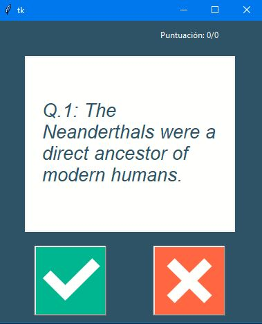
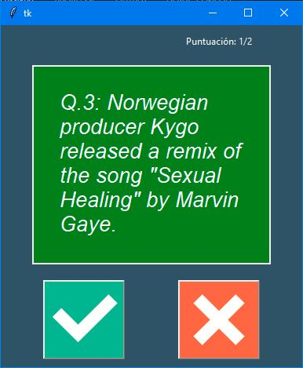
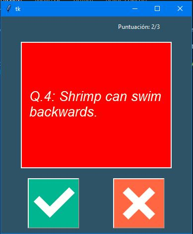

# GUI-Quiz-App
Uso de la api de "Open Trivia DB" para hacer un juego de quiz con GUI

Haciendo uso de esta api se tomaran 25 preguntas de esa api, las cuales usaremos para crear un juego de quiz con GUI en python

----
Aparecera la pregunta y el usuario deberá presionar los botones de cierto o falso

en caso de que sea correcta su respuesta el fondo será de verde y su puntuacion aumentara en 1

sí es incorrecto el fondo se pondrá en rojo y su puntuación no cambia

El juego termina cuando responde todas las preguntas, podrá ver su puntuación en la parte superior de la GUI.
